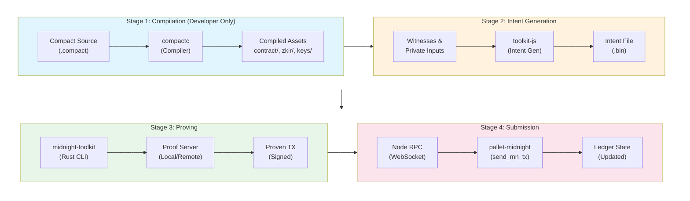
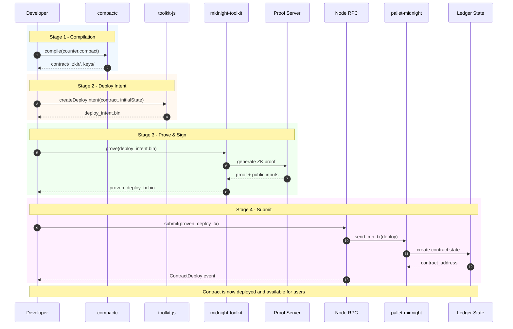
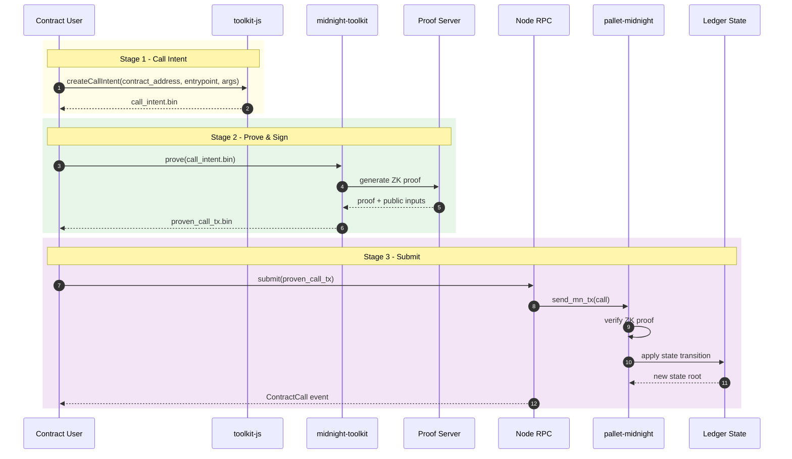
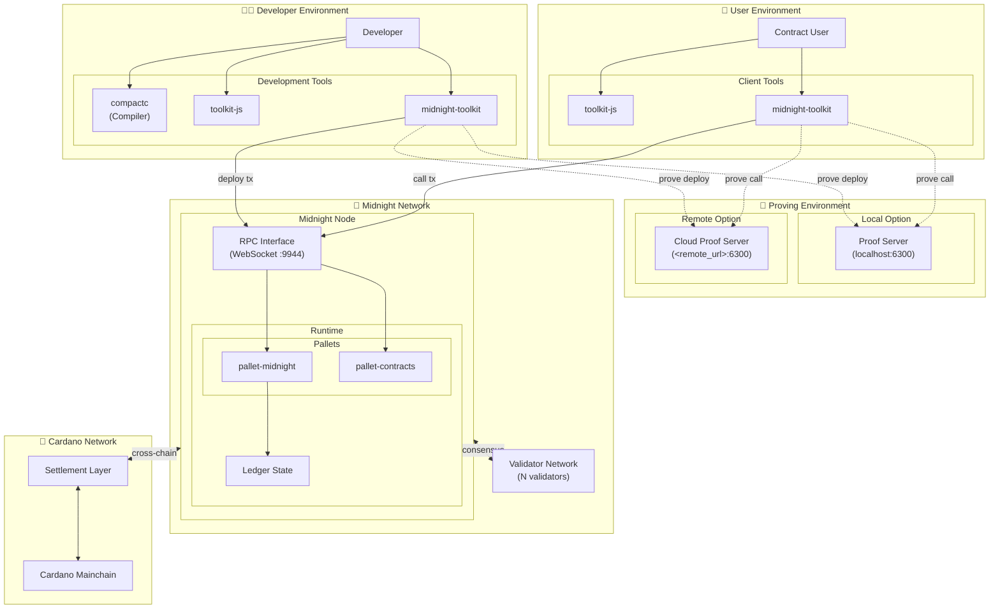

# Compact Contract Deployment and Node Interaction

A detailed guide to deploying [Compact](../GLOSSARY.md#compact) smart contracts on the Midnight blockchain and understanding how they interact with the node.

## Overview

Midnight uses [Compact](../GLOSSARY.md#compact), a domain-specific language for defining privacy-preserving smart contracts [[1]](#ref-1). The deployment process involves several stages: compilation, intent generation, proving, and submission to the node. This document covers the complete lifecycle from source code to on-chain contract state.

## Architecture Overview

### Data Flow

Contract deployment and interaction follow distinct but related flows [[2]](#ref-2).

* **Developers** compile source code once and deploy [[7]](#ref-7);    
* **Users** interact with deployed contracts [[21]](#ref-21).

Both deployment and contract calls share the intent → prove → submit pipeline [[6]](#ref-6) [[8]](#ref-8).



**Note:** Stages 2-4 apply to both deployment (by Developer) and contract calls (by Users).

### Developer Deployment Flow

The deployment workflow is a one-time process where the developer compiles Compact source code [[20]](#ref-20), generates a deploy intent [[3]](#ref-3) [[6]](#ref-6), proves the transaction [[7]](#ref-7) [[8]](#ref-8), and submits it to create the on-chain contract [[5]](#ref-5) [[13]](#ref-13).

**Step References:**
- Steps 1-2 (Compilation): External `compactc` compiler → output structure [[20]](#ref-20)
- Steps 3-4 (Intent): `toolkit-js` deploy command [[3]](#ref-3), `ContractDeployBuilder` [[7]](#ref-7)
- Steps 5-8 (Proving): `send_intent` command [[8]](#ref-8), `RemoteProofServer` [[22]](#ref-22)
- Steps 9-10 (Submit): `Sender::send_tx_no_wait` [[12]](#ref-12), `send_mn_transaction` [[13]](#ref-13)
- Steps 11-13 (Ledger): `LedgerApi::apply_transaction` [[23]](#ref-23), `Event::ContractDeploy` [[24]](#ref-24)



### User Contract Call Flow

After deployment, users interact with the contract by generating call intents [[3]](#ref-3), proving their transactions [[21]](#ref-21) [[8]](#ref-8), and submitting them [[13]](#ref-13). This flow can occur repeatedly for each contract interaction.

**Step References:**
- Steps 1-2 (Intent): `toolkit-js` circuit command [[3]](#ref-3), `ContractCallBuilder` [[21]](#ref-21)
- Steps 3-6 (Proving): `send_intent` command [[8]](#ref-8), `RemoteProofServer` [[22]](#ref-22)
- Steps 7-8 (Submit): `Sender::send_tx_no_wait` [[12]](#ref-12), `send_mn_transaction` [[13]](#ref-13)
- Steps 9-10 (Verify): `LedgerApi::apply_transaction` [[23]](#ref-23) (includes ZK proof verification)
- Steps 11-12 (State): Ledger state transition [[14]](#ref-14), `Event::ContractCall` [[24]](#ref-24)



### Deployment Architecture

The system spans multiple environments with distinct actors [[2]](#ref-2) [[3]](#ref-3).

* **Developers** compile and deploy contracts [[7]](#ref-7);  
* **Users** interact with deployed contracts [[21]](#ref-21).

Both share the proving infrastructure [[9]](#ref-9) [[18]](#ref-18) and submit transactions to the Midnight network [[12]](#ref-12) [[13]](#ref-13), which settles to Cardano.



## Stage 1: Contract Compilation

### Compiling Compact Source

The `compactc` compiler transforms Compact source code into executable artifacts [[2]](#ref-2):

```bash
compactc counter.compact ./output/counter
```

### Generated Artifacts

| Artifact | Description |
|----------|-------------|
| `contract/index.cjs` | JavaScript contract interface [[3]](#ref-3) |
| `zkir/*.zkir` | Zero-knowledge intermediate representation circuits [[18]](#ref-18) |
| `zkir/*.bzkir` | Binary ZKIR format (optimized) |
| `keys/*.prover` | Prover keys for each circuit |
| `keys/*.verifier` | Verifier keys for on-chain verification [[20]](#ref-20) |

### Version Compatibility

Contract artifacts are version-locked. Check compatibility [[4]](#ref-4):

```bash
midnight-node-toolkit version
# Node: X.Y.Z
# Ledger: A.B.C
# Compactc: P.Q.R
```

## Stage 2: Intent Generation

An **Intent** is an intermediate representation capturing the contract action (deploy, call, maintain) along with witness data and private state transitions [[5]](#ref-5).

### Configuration File (contract.config.ts)

The configuration file binds compiled contract output to witness implementations [[3]](#ref-3):

```typescript
import { CompiledContract, ContractExecutable } from '@midnight-ntwrk/compact-js/effect';
import { Contract as CounterContract } from './managed/counter/contract/index.cjs';

type PrivateState = { count: number };

// Witness implementations for private computations
const witnesses = {
  private_increment: ({ privateState }) => [
    { count: privateState.count + 1 }, 
    []
  ]
};

export default {
  contractExecutable: CompiledContract.make<CounterContract>('CounterContract', CounterContract).pipe(
    CompiledContract.withWitnesses(witnesses),
    CompiledContract.withCompiledFileAssets('./managed/counter'),
    ContractExecutable.make
  ),
  createInitialPrivateState: () => ({ count: 0 }),
  config: {
    keys: { coinPublic: '<hex_key>' },
    network: 'undeployed'
  }
};
```

### Generating Deploy Intent (toolkit-js)

Generate a deploy intent using the JavaScript toolkit:

```bash
midnight-node-toolkit-js deploy \
  -c contract.config.ts \
  --coin-public <public_key> \
  --output intent.bin \
  --output-ps private_state.json \
  --output-zswap zswap.json
```

### Generating Deploy Intent (Rust toolkit)

The Rust toolkit delegates to toolkit-js for intent generation [[6]](#ref-6):

```bash
midnight-node-toolkit generate-intent deploy \
  -c contract.config.ts \
  --toolkit-js-path ./toolkit-js/ \
  --coin-public <public_key> \
  --output-intent out/intent.bin \
  --output-private-state out/private_state.json \
  --output-zswap-state out/zswap.json \
  0  # Constructor argument
```

### Intent Structure

The intent encapsulates [[5]](#ref-5)[[7]](#ref-7):

| Component | Description |
|-----------|-------------|
| Contract Deploy Data | Verifier keys, initial state |
| Authority Committee | Maintenance authority public keys (`Vec<VerifyingKey>`) |
| Committee Threshold | Required signatures for maintenance (`u32`) |
| Time-to-Live (TTL) | Transaction validity window |

## Stage 3: Transaction Proving

Proving generates [SNARK](../GLOSSARY.md#snark-succinct-non-interactive-argument-of-knowledge) proofs for the transaction, ensuring privacy guarantees hold [[8]](#ref-8).

### Proving System

Midnight uses a **[PLONK](../GLOSSARY.md#plonk)-based proof system with [KZG](../GLOSSARY.md#kzg-commitment) polynomial commitments** [[18]](#ref-18)[[19]](#ref-19). The system is implemented in the `midnight-proofs` crate and uses:

- **BLS12-381** elliptic curve for pairings
- **JubJub** embedded curve for in-circuit operations
- **KZG commitments** for polynomial commitment scheme
- Support for **committed instances** (proving statements on committed data)
- **Truncated challenges** for efficient recursive proof verification

### Local Proving

Prove transactions locally using the toolkit's built-in prover:

```bash
midnight-node-toolkit send-intent \
  --intent-file intent.bin \
  --compiled-contract-dir ./contract/out
```

### Remote Proving

Offload proving to a dedicated proof server for better performance:

```bash
midnight-node-toolkit send-intent \
  --intent-file intent.bin \
  --compiled-contract-dir ./contract/out \
  --proof-server http://proof-server:8080
```

### Proof Generation Flow

The proof server (local or remote) generates PLONK proofs with KZG commitments [[9]](#ref-9)[[18]](#ref-18):

```
Intent → Unproven Transaction → Proof Server → Proven Transaction
                                     |
                                     v
                              +------------------+
                              | PLONK Prover     |
                              | (KZG Commits)    |
                              +------------------+
                                     |
                                     v
                              +------------------+
                              | Proof Attached   |
                              +------------------+
```

### Transaction Components

A finalized transaction contains [[10]](#ref-10):

| Component | Description |
|-----------|-------------|
| `network_id` | Network identifier (e.g., "undeployed", "testnet") |
| `intents` | Map of segment ID → Intent (deploy/call actions) |
| `guaranteed_offer` | Shielded coin transfers (always applied) |
| `fallible_offer` | Conditional transfers (may fail) |
| `proofs` | PLONK proofs with KZG commitments for each circuit |
| `ttl` | Timestamp after which TX is invalid (default: 600 seconds / 10 min) |

## Stage 4: Node Submission

### WebSocket RPC Connection

Transactions are submitted via WebSocket to the node's JSON-RPC interface [[11]](#ref-11):

```
Default endpoint: ws://127.0.0.1:9944
```

### Submission Flow

The toolkit uses `subxt` to create and submit unsigned extrinsics [[12]](#ref-12):

```rust
// From util/toolkit/src/sender.rs (lines 118-131)
let midnight_tx_hash = tx.transaction_hash();
let tx_serialize = tx.serialize_inner().map_err(|e| self.error(e.into()))?;
let mn_tx = mn_meta::tx().midnight().send_mn_transaction(tx_serialize.clone());
let unsigned_extrinsic = self.api.tx().create_unsigned(&mn_tx)?;
let tx_progress = unsigned_extrinsic.submit_and_watch().await?;
```

### Transaction Lifecycle

Derived from sender.rs logging statements [[12]](#ref-12):

```
SENDING → SENT → BEST_BLOCK → FINALIZED
                     |
                     v
              (Event emitted)
```

## Stage 5: Node Processing

### pallet-midnight Extrinsic

The `send_mn_transaction` extrinsic processes Midnight transactions [[13]](#ref-13):

```rust
// From pallets/midnight/src/lib.rs (lines 353-412)
#[pallet::call_index(0)]
#[pallet::weight(ConfigurableTransactionSizeWeight::<T>::get())]
pub fn send_mn_transaction(_origin: OriginFor<T>, midnight_tx: Vec<u8>) -> DispatchResult {
    let state_key = StateKey::<T>::get().expect("Failed to get state key");
    let block_context = Self::get_block_context();
    let runtime_version = <frame_system::Pallet<T>>::runtime_version().spec_version;

    let result = LedgerApi::apply_transaction(
        &state_key,
        &midnight_tx,
        block_context,
        runtime_version,
    ).map_err(Error::<T>::from)?;

    // Update state root
    StateKey::<T>::put(result.state_root);
    
    // Emit events for each operation type
    // ... ContractCall, ContractDeploy, ContractMaintain, etc.
}
```

### Validation (Pre-dispatch)

Before inclusion in a block, the transaction is validated against the current ledger state [[13]](#ref-13):

```rust
// From pallets/midnight/src/lib.rs (lines 515-540)
fn validate_unsigned(call: &Call<T>, block_context: BlockContext) -> TransactionValidity {
    if let Call::send_mn_transaction { midnight_tx } = call {
        let (tx_hash, _) = LedgerApi::validate_transaction(
            &state_key,
            midnight_tx,
            block_context,
            runtime_version,
        ).map_err(|e| Self::invalid_transaction(e.into()))?;
        
        ValidTransaction::with_tag_prefix("Midnight")
            .longevity(600)  // Max 600 blocks in pool
            .and_provides(tx_hash)
            .build()
    }
}
```

### Ledger State Update

The ledger bridge applies transactions via host functions [[14]](#ref-14):

```
Current State Root → Apply Transaction → New State Root
                            |
                            v
                     +----------------+
                     | Update:        |
                     | - ZSwap tree   |
                     | - Contract     |
                     |   state        |
                     | - UTXOs        |
                     +----------------+
```

## API Endpoints

### Midnight-Specific RPC Methods

The pallet-midnight-rpc crate exposes custom JSON-RPC methods [[15]](#ref-15):

```rust
// From pallets/midnight/rpc/src/lib.rs (lines 32-49)
#[rpc(client, server)]
pub trait MidnightApi<BlockHash> {
    #[method(name = "midnight_contractState")]
    fn get_state(&self, contract_address: String, at: Option<BlockHash>) -> Result<String, StateRpcError>;

    #[method(name = "midnight_zswapStateRoot")]
    fn get_zswap_state_root(&self, at: Option<BlockHash>) -> Result<Vec<u8>, StateRpcError>;

    #[method(name = "midnight_apiVersions")]
    fn get_supported_api_versions(&self) -> RpcResult<Vec<u32>>;

    #[method(name = "midnight_ledgerVersion")]
    fn get_ledger_version(&self, at: Option<BlockHash>) -> Result<String, BlockRpcError>;
}
```

| Method | Description | Parameters |
|--------|-------------|------------|
| `midnight_contractState` | Get contract state | `contract_address`, `at` (optional block) |
| `midnight_zswapStateRoot` | Get ZSwap Merkle root | `at` (optional block) |
| `midnight_ledgerVersion` | Get ledger version | `at` (optional block) |
| `midnight_apiVersions` | Get supported API versions | None |

### Usage Examples

Examples of calling Midnight RPC methods using curl.

#### Get Contract State

Retrieve the current state of a deployed contract:

```bash
curl -X POST http://localhost:9933 \
  -H "Content-Type: application/json" \
  -d '{
    "jsonrpc": "2.0",
    "id": 1,
    "method": "midnight_contractState",
    "params": ["<contract_address_hex>", null]
  }'
```

#### Response

The RPC returns the serialized contract state as a hex string:

```json
{
  "jsonrpc": "2.0",
  "id": 1,
  "result": "<serialized_contract_state_hex>"
}
```

### Standard Substrate RPC

Standard Substrate RPC methods also available on Midnight nodes:

| Method | Description |
|--------|-------------|
| `author_submitExtrinsic` | Submit unsigned extrinsic |
| `author_submitAndWatchExtrinsic` | Submit and subscribe to status |
| `chain_getBlockHash` | Get block hash by number |
| `state_getStorage` | Get raw storage value |

## Events

### Contract Events

Events emitted by pallet-midnight [[13]](#ref-13):

```rust
// From pallets/midnight/src/lib.rs (lines 216-235)
#[pallet::event]
pub enum Event {
    ContractCall(CallDetails),           // tx_hash, contract_address
    ContractDeploy(DeploymentDetails),   // tx_hash, contract_address
    TxApplied(TxAppliedDetails),         // tx_hash
    ContractMaintain(MaintainDetails),   // tx_hash, contract_address
    PayoutMinted(PayoutDetails),         // amount, receiver
    ClaimRewards(ClaimRewardsDetails),   // tx_hash, value
    UnshieldedTokens(UnshieldedTokensDetails), // spent, created
    TxPartialSuccess(TxAppliedDetails),  // tx_hash
}
```

| Event | Emitted When |
|-------|--------------|
| `ContractDeploy { tx_hash, contract_address }` | New contract deployed |
| `ContractCall { tx_hash, contract_address }` | Contract entrypoint invoked |
| `ContractMaintain { tx_hash, contract_address }` | Authority or verifier updated |
| `TxApplied { tx_hash }` | Transaction fully applied |
| `TxPartialSuccess { tx_hash }` | Guaranteed part applied, fallible failed |
| `UnshieldedTokens { spent, created }` | UTXO transfers |

### Subscribing to Events

Subscribe to Midnight events using the Polkadot.js API:

```javascript
const api = await ApiPromise.create({ provider: wsProvider });
api.query.system.events((events) => {
  events.forEach((record) => {
    const { event } = record;
    if (event.section === 'midnight') {
      console.log(`${event.method}: ${event.data}`);
    }
  });
});
```

> **⚠️** JavaScript API example based on standard Polkadot.js patterns. Verify against actual Midnight SDK documentation.

## Complete Deployment Example

A step-by-step walkthrough of deploying a Compact contract from source to on-chain state.

### 1. Compile Contract

Compile the Compact source file to generate contract artifacts:

```bash
compactc counter.compact ./managed/counter
```

### 2. Generate Intent

Create a deploy intent with initial constructor arguments:

```bash
midnight-node-toolkit generate-intent deploy \
  -c contract.config.ts \
  --toolkit-js-path ./toolkit-js/ \
  --coin-public $(midnight-node-toolkit show-address --network undeployed --seed <seed> --coin-public) \
  --output-intent out/deploy_intent.bin \
  --output-private-state out/ps.json \
  --output-zswap-state out/zswap.json \
  0
```

### 3. Build and Send Transaction

Prove the intent and submit the transaction to the node:

```bash
midnight-node-toolkit send-intent \
  --intent-file out/deploy_intent.bin \
  --compiled-contract-dir ./managed/counter
```

### 4. Get Contract Address

Extract the contract address from the deployment transaction:

```bash
midnight-node-toolkit contract-address \
  --src-file deploy_tx.mn
# Output: 040dcc237a542543f1c0e0af4a8e937f74f357a238c9d2a9fcfcd644eb0f5c70
```

### 5. Query Contract State

Fetch the current contract state from the node:

```bash
midnight-node-toolkit contract-state \
  --src-url ws://127.0.0.1:9944 \
  --contract-address 040dcc237a542543f1c0e0af4a8e937f74f357a238c9d2a9fcfcd644eb0f5c70 \
  --dest-file contract_state.bin
```

## Contract Maintenance

After deployment, contract authority holders can update verifier keys or transfer authority [[16]](#ref-16):

### Update Signing Authority

Transfer contract maintenance authority to a new signing key:

```bash
midnight-node-toolkit generate-intent maintain-contract \
  --contract-address <address> \
  --signing <current_key> \
  <new_signing_key>
```

### Update Circuit Verifier

Replace the verifier key for a specific circuit entrypoint:

```bash
midnight-node-toolkit generate-intent maintain-circuit \
  --contract-address <address> \
  --signing <key> \
  <circuit_id> \
  <new_verifier_key_path>
```

## Error Handling

### Pallet Errors

Errors defined in pallet-midnight [[13]](#ref-13):

```rust
// From pallets/midnight/src/lib.rs (lines 238-264)
#[pallet::error]
pub enum Error<T> {
    NewStateOutOfBounds,
    Deserialization(DeserializationError),
    Serialization(SerializationError),
    Transaction(TransactionError),
    LedgerCacheError,
    NoLedgerState,
    LedgerStateScaleDecodingError,
    ContractCallCostError,
    BlockLimitExceededError,
    FeeCalculationError,
    HostApiError,
    NetworkIdNotString,
}
```

| Error | Cause | Resolution |
|-------|-------|------------|
| `Deserialization` | Invalid transaction format | Check compactc version compatibility |
| `Transaction` | Ledger validation failed | See TransactionError sub-types below |
| `BlockLimitExceededError` | TX too large for block | Split transaction or reduce operations |
| `FeeCalculationError` | Fee computation failed | Check DUST balance |

### Transaction Validation Errors

From `ledger/src/versions/common/types.rs` [[17]](#ref-17):

```rust
pub enum TransactionError {
    Invalid(InvalidError),      // Semantic validation failures
    Malformed(MalformedError),  // Structural/proof failures
    SystemTransaction(SystemTransactionError),
}

pub enum InvalidError {
    EffectsMismatch,
    ContractAlreadyDeployed,
    ContractNotPresent,
    Zswap,
    Transcript,
    InsufficientClaimable,
    VerifierKeyNotFound,
    VerifierKeyAlreadyPresent,
    ReplayCounterMismatch,
    UnknownError,
}

pub enum MalformedError {
    InvalidProof,
    NotNormalized,
    Unbalanced,
    ThresholdMissed,
    // ... and more
}
```

## Performance Considerations

### Proving Time

Typical proof generation times vary based on circuit complexity:

| Operation | Typical Duration |
|-----------|------------------|
| Deploy (simple) | 10-30 seconds |
| Circuit call | 5-15 seconds |
| Complex TX | 30-60+ seconds |

> **⚠️** Duration estimates are approximate and based on general PLONK proving characteristics. Actual times depend on circuit complexity, hardware, and proving configuration. The `midnight-proofs` crate supports parallelism via `RAYON_NUM_THREADS` [[19]](#ref-19).

### Optimization Tips

Strategies to improve deployment and transaction performance:

1. Use remote proof server for faster proving
2. Batch multiple operations where possible
3. Pre-compute intents offline
4. Use appropriate TTL (10 minutes default) [[10]](#ref-10)
5. Set `RAYON_NUM_THREADS` for parallel proof generation [[19]](#ref-19)

---

## See Also

- [util/toolkit](../util/toolkit/README.md) - Rust CLI toolkit
- [util/toolkit-js](../util/toolkit-js/README.md) - JavaScript toolkit
- [pallet-midnight](../pallets/midnight/README.md) - Core pallet documentation
- [ledger](../ledger/README.md) - Ledger integration
- [GLOSSARY](../GLOSSARY.md) - Term definitions
- [Compact Language Reference](https://docs.midnight.network/develop/reference/compact) - Official Compact documentation

---

## References

| # | Source | Path/URL |
|---|--------|----------|
| <a id="ref-1"></a>[1] | Midnight Official Documentation | [https://docs.midnight.network](https://docs.midnight.network) |
| <a id="ref-2"></a>[2] | Midnight Toolkit README - Custom Contracts | [`util/toolkit/README.md#custom-contracts`](https://github.com/m2ux/midnight-node/blob/mc_study/util/toolkit/README.md#custom-contracts) |
| <a id="ref-3"></a>[3] | Toolkit-JS README - Contract Configuration File | [`util/toolkit-js/README.md#contract-configuration-file`](https://github.com/m2ux/midnight-node/blob/mc_study/util/toolkit-js/README.md#contract-configuration-file) |
| <a id="ref-4"></a>[4] | Midnight Toolkit README - Version Check | [`util/toolkit/README.md#check-version`](https://github.com/m2ux/midnight-node/blob/mc_study/util/toolkit/README.md#check-version) |
| <a id="ref-5"></a>[5] | Ledger Helpers - Contract Deploy | [`ledger/helpers/src/versions/common/contract/deploy.rs`](https://github.com/m2ux/midnight-node/blob/mc_study/ledger/helpers/src/versions/common/contract/deploy.rs) |
| <a id="ref-6"></a>[6] | Generate Intent Command | [`util/toolkit/src/commands/generate_intent.rs`](https://github.com/m2ux/midnight-node/blob/mc_study/util/toolkit/src/commands/generate_intent.rs) |
| <a id="ref-7"></a>[7] | Contract Deploy Builder | [`util/toolkit/src/tx_generator/builder/builders/contract_deploy.rs`](https://github.com/m2ux/midnight-node/blob/mc_study/util/toolkit/src/tx_generator/builder/builders/contract_deploy.rs) |
| <a id="ref-8"></a>[8] | Send Intent Command | [`util/toolkit/src/commands/send_intent.rs`](https://github.com/m2ux/midnight-node/blob/mc_study/util/toolkit/src/commands/send_intent.rs) |
| <a id="ref-9"></a>[9] | Genesis Generator - Proof Server | [`util/toolkit/src/genesis_generator.rs#L304-L342`](https://github.com/m2ux/midnight-node/blob/mc_study/util/toolkit/src/genesis_generator.rs#L304-L342) |
| <a id="ref-10"></a>[10] | Transaction Builder - TTL | [`ledger/helpers/src/versions/common/transaction.rs#L170`](https://github.com/m2ux/midnight-node/blob/mc_study/ledger/helpers/src/versions/common/transaction.rs#L170) |
| <a id="ref-11"></a>[11] | Destination Module - Default URL | [`util/toolkit/src/tx_generator/destination.rs#L24`](https://github.com/m2ux/midnight-node/blob/mc_study/util/toolkit/src/tx_generator/destination.rs#L24) |
| <a id="ref-12"></a>[12] | Sender Module - TX Submission | [`util/toolkit/src/sender.rs#L113-L143`](https://github.com/m2ux/midnight-node/blob/mc_study/util/toolkit/src/sender.rs#L113-L143) |
| <a id="ref-13"></a>[13] | Pallet Midnight - Extrinsics, Events, Errors | [`pallets/midnight/src/lib.rs`](https://github.com/m2ux/midnight-node/blob/mc_study/pallets/midnight/src/lib.rs) |
| <a id="ref-14"></a>[14] | Ledger State Management | [`ledger/src/versions/common/mod.rs`](https://github.com/m2ux/midnight-node/blob/mc_study/ledger/src/versions/common/mod.rs) |
| <a id="ref-15"></a>[15] | Pallet Midnight RPC | [`pallets/midnight/rpc/src/lib.rs#L32-L49`](https://github.com/m2ux/midnight-node/blob/mc_study/pallets/midnight/rpc/src/lib.rs#L32-L49) |
| <a id="ref-16"></a>[16] | Contract Maintenance | [`ledger/helpers/src/versions/common/contract/maintenance.rs`](https://github.com/m2ux/midnight-node/blob/mc_study/ledger/helpers/src/versions/common/contract/maintenance.rs) |
| <a id="ref-17"></a>[17] | Transaction Error Types | [`ledger/src/versions/common/types.rs#L30-L91`](https://github.com/m2ux/midnight-node/blob/mc_study/ledger/src/versions/common/types.rs#L30-L91), [`#L127-L131`](https://github.com/m2ux/midnight-node/blob/mc_study/ledger/src/versions/common/types.rs#L127-L131) |
| <a id="ref-18"></a>[18] | Midnight ZK - Repository Structure, Controlling Parallelism | [`midnight-zk/README.md#repository-structure`](https://github.com/m2ux/midnight-zk/blob/main/README.md#repository-structure), [`midnight-zk/proofs/README.md#controlling-parallelism`](https://github.com/m2ux/midnight-zk/blob/main/proofs/README.md#controlling-parallelism) |
| <a id="ref-19"></a>[19] | Midnight Proofs - PLONK Implementation | [`midnight-zk/proofs/Cargo.toml`](https://github.com/m2ux/midnight-zk/blob/main/proofs/Cargo.toml) |
| <a id="ref-20"></a>[20] | Compiled Contract Example | [`static/contracts/simple-merkle-tree/`](https://github.com/m2ux/midnight-node/blob/mc_study/static/contracts/simple-merkle-tree/) |
| <a id="ref-21"></a>[21] | Contract Call Builder | [`util/toolkit/src/tx_generator/builder/builders/contract_call.rs`](https://github.com/m2ux/midnight-node/blob/mc_study/util/toolkit/src/tx_generator/builder/builders/contract_call.rs) |
| <a id="ref-22"></a>[22] | Remote Proof Server | [`util/toolkit/src/tx_generator/mod.rs#L152-L164`](https://github.com/m2ux/midnight-node/blob/mc_study/util/toolkit/src/tx_generator/mod.rs#L152-L164) |
| <a id="ref-23"></a>[23] | LedgerApi::apply_transaction | [`pallets/midnight/src/lib.rs#L360-L394`](https://github.com/m2ux/midnight-node/blob/mc_study/pallets/midnight/src/lib.rs#L360-L394) |
| <a id="ref-24"></a>[24] | Contract Events (Deploy/Call) | [`pallets/midnight/src/lib.rs#L220-L222`](https://github.com/m2ux/midnight-node/blob/mc_study/pallets/midnight/src/lib.rs#L220-L222), [`#L375-L381`](https://github.com/m2ux/midnight-node/blob/mc_study/pallets/midnight/src/lib.rs#L375-L381) |
