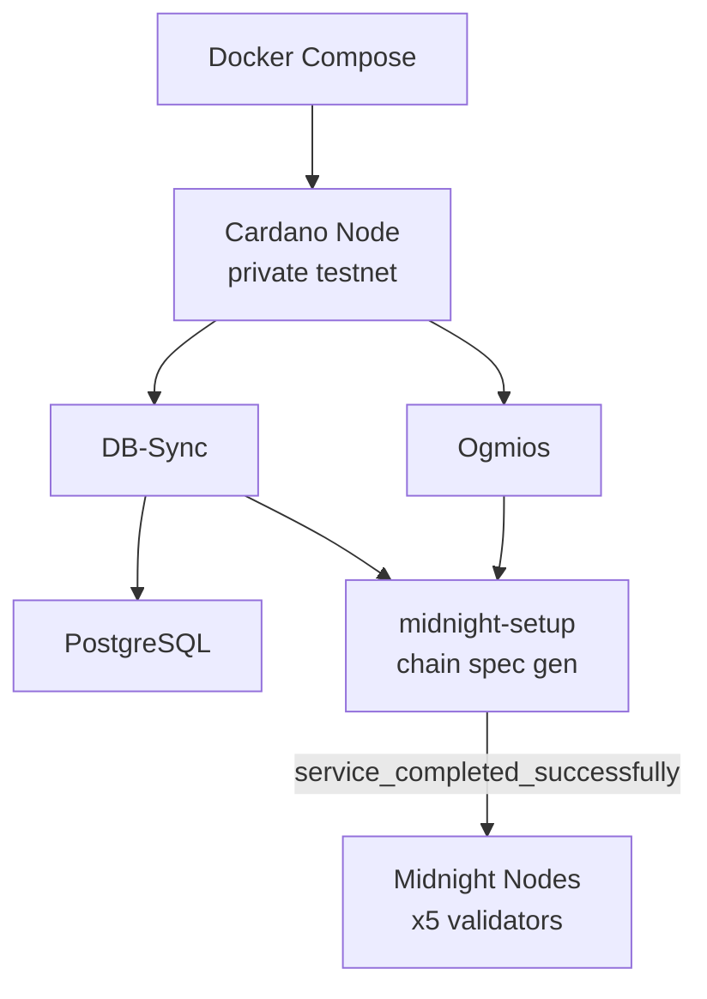

# local-environment

Docker-based tooling for launching Midnight networks and performing state operations.

## Overview

A flexible set of tools for launching **well-known networks, custom networks, and dynamic local environments**, as well as **performing state changes** against those networks (image upgrades, [runtime](https://docs.midnight.network/learn/glossary#runtime) upgrades, and hard forks).

This project provides a unified way to spin up Midnight resources for development, testing, and experimentation.

## Features

- Launch dockerized **well-known Midnight networks** (e.g., `qanet`, `devnet`, `testnet-02`)
- Perform **state-changing operations** such as image upgrades ([runtime](https://docs.midnight.network/learn/glossary#runtime) upgrades and hard forks planned)
- Launch a fully **dynamic local environment** with sped-up Cardano resources for quick testing of [Partner Chain](https://docs.midnight.network/learn/glossary#partner-chain)/Cardano capabilities

## API Specification

### npm Scripts

| Script | Description |
|--------|-------------|
| `npm run run:qanet` | Launch QAnet network |
| `npm run run:devnet` | Launch [Devnet](https://docs.midnight.network/learn/glossary#devnet) network |
| `npm run run:testnet-02` | Launch [Testnet](https://docs.midnight.network/learn/glossary#testnet) 02 |
| `npm run run:node-dev-01` | Launch node-dev-01 network |
| `npm run run:local-env` | Launch dynamic local environment |
| `npm run run:local-env-with-indexer` | Local env with indexer |
| `npm run stop:*` | Stop corresponding network |
| `npm run image-upgrade:*` | Launch and apply image upgrade |

### Earthly Targets

| Target | Description |
|--------|-------------|
| `+start-local-env-latest` | Start local env with latest node |
| `+start-local-env --NODE-IMAGE=<image>` | Start with specific node image |
| `+stop-local-env-latest` | Stop local env and wipe volumes |

## Usage

### Launching Networks

```bash
# Well-known networks
npm run run:qanet
npm run run:devnet
npm run run:testnet-02
npm run run:node-dev-01
```

### Upgrading Networks

```bash
npm run image-upgrade:qanet
npm run image-upgrade:devnet
npm run image-upgrade:testnet-02
```

### Stopping Networks

```bash
npm run stop:qanet
npm run stop:devnet
npm run stop:testnet-02
```

### Local Environment

#### Starting

Via Earthly:
```bash
earthly +start-local-env-latest
```

With specific node image:
```bash
earthly +start-local-env --NODE-IMAGE=ghcr.io/midnight-ntwrk/midnight-node:0.12.0
```

Via npm:
```bash
npm run run:local-env
npm run run:local-env-with-indexer
```

#### Stopping

When stopping, volumes must be wiped (persistent state not yet supported):

```bash
earthly +stop-local-env-latest
```

Or with specific image:
```bash
earthly +stop-local-env --NODE-IMAGE=ghcr.io/midnight-ntwrk/midnight-node:0.12.0
```

## Architecture

### Local Environment Startup Sequence



**Sources**: [[1]](https://github.com/midnightntwrk/midnight-node/blob/main/local-environment/src/networks/local-env/docker-compose.yml)

### Component Summary

| Component | Purpose |
|-----------|---------|
| Cardano Node | Private testnet block production |
| Ogmios | Cardano chain sync API |
| [db-sync](https://docs.midnight.network/learn/glossary#db-sync) | Cardano to PostgreSQL indexer |
| PostgreSQL | Cardano data storage |
| midnight-setup | Chain spec generation and initialization |
| Midnight Node(s) | Sidechain block production (5 validators) |

## Configuration

Configuration is managed via:
- `package.json` - npm scripts
- Docker Compose files - container orchestration
- Earthfile - Earthly targets

## Integration

### Dependencies

- Docker and Docker Compose
- Earthly (optional, for Earthly targets)
- Node.js and npm

### Used By

- Development and testing workflows
- CI/CD pipelines
- Fork testing (see [fork-testing.md](../docs/fork-testing.md))

## See Also

- [Fork Testing Guide](../docs/fork-testing.md) - Hard fork testing procedures
- [node](../node/README.md) - Node documentation
- [Glossary](https://docs.midnight.network/learn/glossary) - Term definitions
