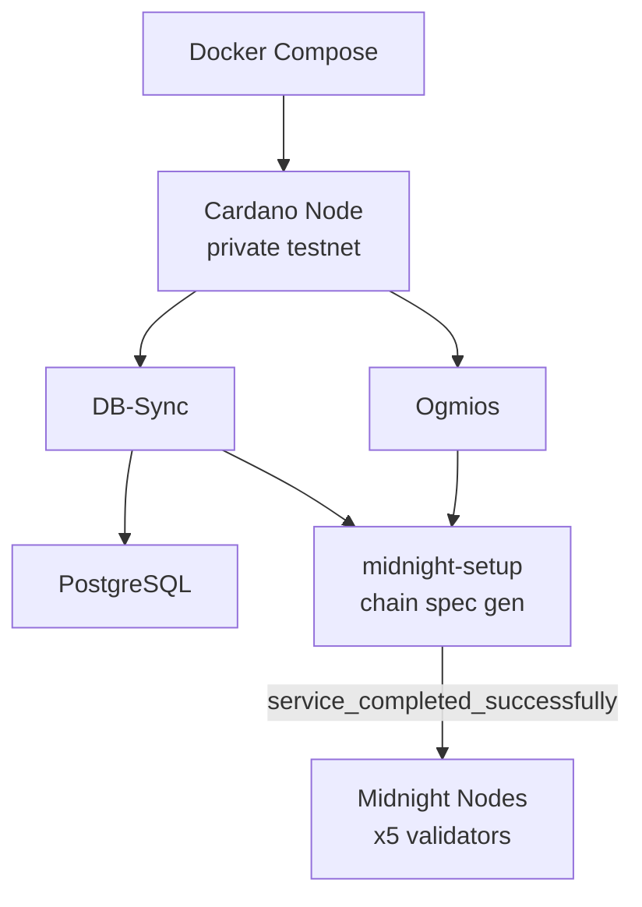

# local-environment

Docker-based tooling for launching Midnight networks and performing state operations.

## Overview

A flexible set of tools for launching **well-known networks, custom networks, and dynamic local environments**, as well as **performing state changes** against those networks (image upgrades, [runtime](https://docs.polkadot.com/polkadot-protocol/glossary/#runtime) upgrades, and hard forks).

This project provides a unified way to spin up Midnight resources for development, testing, and experimentation.

## Features

- Launch dockerized **well-known Midnight networks** (e.g., `qanet`, `devnet`, `testnet-02`)
- Perform **state-changing operations** such as image upgrades ([runtime](https://docs.polkadot.com/polkadot-protocol/glossary/#runtime) upgrades and hard forks planned)
- Launch a fully **dynamic local environment** with sped-up Cardano resources for quick testing of [Partner Chain](https://docs.midnight.network/learn/glossary#partner-chain)/Cardano capabilities

## API Specification

### npm Scripts

| Script | Description |
|--------|-------------|
| `npm run run:qanet` | Launch QAnet network |
| `npm run run:devnet` | Launch [Devnet](https://docs.midnight.network/learn/glossary#devnet) network |
| `npm run run:testnet-02` | Launch [Testnet](https://docs.midnight.network/learn/glossary#testnet) 02 |
| `npm run run:node-dev-01` | Launch node-dev-01 network |
| `npm run run:local-env` | Launch dynamic local environment |
| `npm run run:local-env-with-indexer` | Local env with indexer |
| `npm run stop:*` | Stop corresponding network |
| `npm run image-upgrade:*` | Launch and apply image upgrade |

### Earthly Targets

| Target | Description |
|--------|-------------|
| `+start-local-env-latest` | Start local env with latest node |
| `+start-local-env --NODE-IMAGE=<image>` | Start with specific node image |
| `+stop-local-env-latest` | Stop local env and wipe volumes |

## Usage

### Launching Networks

```bash
# Well-known networks
npm run run:qanet
npm run run:devnet
npm run run:testnet-02
npm run run:node-dev-01
```

### Upgrading Networks

```bash
npm run image-upgrade:qanet
npm run image-upgrade:devnet
npm run image-upgrade:testnet-02
```

### Stopping Networks

```bash
npm run stop:qanet
npm run stop:devnet
npm run stop:testnet-02
```

### Local Environment

#### Starting

Via Earthly:
```bash
earthly +start-local-env-latest
```

With specific node image:
```bash
earthly +start-local-env --NODE-IMAGE=ghcr.io/midnight-ntwrk/midnight-node:0.12.0
```

Via npm:
```bash
npm run run:local-env
npm run run:local-env-with-indexer
```

#### Stopping

When stopping, volumes must be wiped (persistent state not yet supported):

```bash
earthly +stop-local-env-latest
```

Or with specific image:
```bash
earthly +stop-local-env --NODE-IMAGE=ghcr.io/midnight-ntwrk/midnight-node:0.12.0
```

## Architecture

### Local Environment Startup Sequence

The local environment uses Docker Compose to orchestrate a complete Midnight development stack. Startup follows a dependency chain: the Cardano node initializes first, producing a private testnet with accelerated parameters. Ogmios and DB-Sync connect to Cardano, with DB-Sync populating PostgreSQL with indexed chain data. Once DB-Sync is synced, the `midnight-setup` service generates chain specifications using observed Cardano state. Finally, five Midnight validator nodes start with the generated chain spec, forming a functional sidechain connected to the local Cardano testnet.



**Sources**: [[1]](https://github.com/midnightntwrk/midnight-node/blob/main/local-environment/src/networks/local-env/docker-compose.yml)

### Component Summary

| Component | Purpose |
|-----------|---------|
| Cardano Node | Private testnet block production |
| Ogmios | Cardano chain sync API |
| [db-sync](https://docs.midnight.network/learn/glossary#db-sync) | Cardano to PostgreSQL indexer |
| PostgreSQL | Cardano data storage |
| midnight-setup | Chain spec generation and initialization |
| Midnight Node(s) | Sidechain block production (5 validators) |

## Manual Node Startup (Without Docker)

For development without Docker, you can start nodes directly using the binary.

### Configuration Parameters

| Parameter | Environment Variable | CLI Flag | Description |
|-----------|---------------------|----------|-------------|
| Config preset | `CFG_PRESET=dev` | - | Development mode configuration |
| AURA seed | `AURA_SEED_FILE=/path/to/seed` | - | Path to AURA consensus seed file |
| GRANDPA seed | `GRANDPA_SEED_FILE=/path/to/seed` | - | Path to GRANDPA finality seed file |
| Cross-chain seed | `CROSS_CHAIN_SEED_FILE=/path/to/seed` | - | Path to cross-chain seed file |
| Chain spec | `CHAIN=local` | `--chain local` | Network to connect to |
| Base path | `BASE_PATH=/tmp/node-1` | `--base-path /tmp/node-1` | Data directory |
| Validator mode | `VALIDATOR=true` | `--validator` | Run as validator |
| P2P port | - | `--port 30333` | Networking port (default: 30333) |
| RPC port | - | `--rpc-port 9944` | WebSocket RPC port (default: 9944) |
| Node key | `NODE_KEY_FILE=/path/to/key` | `--node-key "0x..."` | Network identity key file |
| Bootstrap nodes | `BOOTNODES="/ip4/..."` | `--bootnodes "/ip4/..."` | Initial peers |

### Single-Node Local Network

```shell
echo "//Alice" > /tmp/alice-seed && \
CFG_PRESET=dev AURA_SEED_FILE=/tmp/alice-seed GRANDPA_SEED_FILE=/tmp/alice-seed CROSS_CHAIN_SEED_FILE=/tmp/alice-seed \
  BASE_PATH=/tmp/node-1 CHAIN=local VALIDATOR=true ./target/release/midnight-node
```

### Multi-Node Local Network

Start 6 authority nodes using the `local` chain specification:

```shell
# Node 1 (Alice) - Bootstrap node
echo "//Alice" > /tmp/alice-seed && echo "0000000000000000000000000000000000000000000000000000000000000001" > /tmp/alice-key && \
CFG_PRESET=dev AURA_SEED_FILE=/tmp/alice-seed GRANDPA_SEED_FILE=/tmp/alice-seed CROSS_CHAIN_SEED_FILE=/tmp/alice-seed \
  NODE_KEY_FILE=/tmp/alice-key BASE_PATH=/tmp/node-1 CHAIN=local VALIDATOR=true ./target/release/midnight-node --port 30333

# Node 2-6 (Bob, Charlie, Dave, Eve, Ferdie) - Connect to Alice
# Replace seed name and port for each node (30334-30338)
echo "//Bob" > /tmp/bob-seed && echo "0000000000000000000000000000000000000000000000000000000000000002" > /tmp/bob-key && \
CFG_PRESET=dev AURA_SEED_FILE=/tmp/bob-seed GRANDPA_SEED_FILE=/tmp/bob-seed CROSS_CHAIN_SEED_FILE=/tmp/bob-seed \
  NODE_KEY_FILE=/tmp/bob-key BASE_PATH=/tmp/node-2 CHAIN=local VALIDATOR=true \
  BOOTNODES="/ip4/127.0.0.1/tcp/30333/p2p/12D3KooWEyoppNCUx8Yx66oV9fJnriXwCcXwDDUA2kj6vnc6iDEp" \
  ./target/release/midnight-node --port 30334
```

Repeat for Charlie (node-3, port 30335), Dave (node-4, port 30336), Eve (node-5, port 30337), and Ferdie (node-6, port 30338).

## Configuration

Configuration is managed via:
- `package.json` - npm scripts
- Docker Compose files - container orchestration
- Earthfile - Earthly targets

## Integration

### Dependencies

- Docker and Docker Compose
- Earthly (optional, for Earthly targets)
- Node.js and npm

### Used By

- Development and testing workflows
- CI/CD pipelines
- Fork testing (see [fork-testing.md](../docs/fork-testing.md))

## See Also

- [Fork Testing Guide](../docs/fork-testing.md) - Hard fork testing procedures
- [node](../node/README.md) - Node documentation
- [Glossary](https://docs.midnight.network/learn/glossary) - Term definitions
