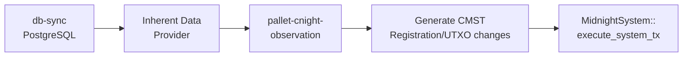
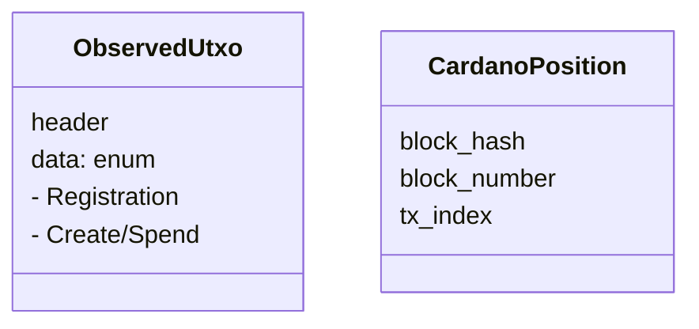

# pallet-cnight-observation

[Pallet](https://docs.polkadot.com/polkadot-protocol/glossary/#pallet) for observing [cNIGHT](https://docs.midnight.network/learn/glossary#cnight) token movements on Cardano and generating [DUST](https://docs.midnight.network/learn/glossary#dust) on Midnight.

## Overview

This pallet bridges Cardano mainchain observations to the Midnight ledger. It tracks:

- **[cNIGHT](https://docs.midnight.network/learn/glossary#cnight) registrations** - Wallet mappings between Cardano reward addresses and [DUST](https://docs.midnight.network/learn/glossary#dust) public keys
- **[cNIGHT](https://docs.midnight.network/learn/glossary#cnight) UTXOs** - Token holdings that generate [DUST](https://docs.midnight.network/learn/glossary#dust) over time
- **[Glacier Drop](https://docs.midnight.network/learn/glossary#glacier-drop) redemptions** - One-time token claims

Observations arrive via inherents from the mainchain follower data source. The pallet generates Cardano Midnight System Transactions (CMSTs) that are applied to the ledger state.

## API Specification

### Storage Items

- [**`NextCardanoPosition`**](https://github.com/midnightntwrk/midnight-node/blob/main/pallets/cnight-observation/src/lib.rs#L185) - Next block/tx to process
- [**`MainChainRedemptionValidatorAddress`**](https://github.com/midnightntwrk/midnight-node/blob/main/pallets/cnight-observation/src/lib.rs#L171) - Glacier Drop contract address
- [**`MainChainMappingValidatorAddress`**](https://github.com/midnightntwrk/midnight-node/blob/main/pallets/cnight-observation/src/lib.rs#L161) - Registration mapping contract
- [**`CNightIdentifier`**](https://github.com/midnightntwrk/midnight-node/blob/main/pallets/cnight-observation/src/lib.rs#L189) - cNIGHT token identifier
- [**`MainChainAuthTokenAssetName`**](https://github.com/midnightntwrk/midnight-node/blob/main/pallets/cnight-observation/src/lib.rs#L166) - Auth token asset name
- [**`CardanoTxCapacityPerBlock`**](https://github.com/midnightntwrk/midnight-node/blob/main/pallets/cnight-observation/src/lib.rs#L216) - Max Cardano txs per block
- [**`CardanoBlockWindowSize`**](https://github.com/midnightntwrk/midnight-node/blob/main/pallets/cnight-observation/src/lib.rs#L206) - Observation window size

### Events

- [**`Event`**](https://github.com/midnightntwrk/midnight-node/blob/main/pallets/cnight-observation/src/lib.rs#L137) - Registration, Deregistration, MappingAdded, MappingRemoved, SystemTransactionApplied

### Errors

- [**`Error`**](https://github.com/midnightntwrk/midnight-node/blob/main/pallets/cnight-observation/src/lib.rs#L146) - MaxCardanoAddrLengthExceeded, MaxRegistrationsExceeded, LedgerApiError

### Config Trait

- [**`MidnightSystemTransactionExecutor`**](https://github.com/midnightntwrk/midnight-node/blob/main/pallets/cnight-observation/src/lib.rs#L132) - Interface to apply system transactions

### Inherent

- [**`INHERENT_IDENTIFIER`**](https://github.com/midnightntwrk/midnight-node/blob/main/pallets/cnight-observation/src/lib.rs#L291) - `ntobsrve` - Observed UTXOs and next position

## Architecture

### Observation Flow

The observation pipeline begins with db-sync indexing Cardano blocks into PostgreSQL. The inherent data provider queries for cNIGHT-related UTXOs within a configurable block window, packaging them as `MidnightObservationTokenMovement` inherent data. At block authoring time, validators include this data which the pallet processes via its inherent handler. For each observed UTXO, the pallet generates appropriate Cardano Midnight System Transactions (registrations, UTXO creates/spends, redemptions) and executes them through `pallet-midnight-system`.



**Sources**: [[1]](https://github.com/midnightntwrk/midnight-node/blob/main/pallets/cnight-observation/src/lib.rs#L287-L325) [[2]](https://github.com/midnightntwrk/midnight-node/blob/main/node/src/inherent_data.rs#L141-L180)

### Data Types

Observed UTXOs carry both position metadata (for ordering and deduplication) and typed payload data. The `ObservedUtxoHeader` identifies the Cardano block and transaction where the UTXO was observed, while `ObservedUtxoData` variants encode the specific operation (registration, asset creation/spend, redemption). `CardanoPosition` tracks sync progress to ensure observations are processed exactly once in order.



**Sources**: [[1]](https://github.com/midnightntwrk/midnight-node/blob/main/primitives/cnight-observation/src/lib.rs#L45-L95) [[2]](https://github.com/midnightntwrk/midnight-node/blob/main/primitives/cnight-observation/src/lib.rs#L97-L115)

## Genesis Configuration

From `pallets/cnight-observation/src/config.rs` - genesis is configured via JSON:

```json
{
  "addresses": {
    "mapping_validator_address": "addr_test1...",
    "redemption_validator_address": "addr_test1...",
    "auth_token_asset_name": "",
    "cnight_policy_id": "03cf16101d110dcad9cacb225f0d1e63a8809979e7feb60426995414",
    "cnight_asset_name": ""
  },
  "observed_utxos": { "start": {...}, "end": {...}, "utxos": [] },
  "mappings": {},
  "utxo_owners": {},
  "next_cardano_position": { "block_hash": "...", "block_number": 0, ... },
  "system_tx": null
}
```

See `pallets/cnight-observation/src/config.rs` for full `CNightGenesis` structure.

## Integration

### Dependencies

- [`midnight-primitives-cnight-observation`](https://github.com/midnightntwrk/midnight-node/blob/main/primitives/cnight-observation/src/lib.rs) - Shared types
- [`midnight-primitives-mainchain-follower`](https://github.com/midnightntwrk/midnight-node/blob/main/primitives/mainchain-follower/src/lib.rs) - Data source traits
- [`pallet-midnight-system`](https://github.com/midnightntwrk/midnight-node/blob/main/pallets/midnight-system/src/lib.rs) - System transaction execution

### Used By

- [`runtime`](https://github.com/midnightntwrk/midnight-node/blob/main/runtime/src/lib.rs) - Inherent provider
- [`midnight-node`](https://github.com/midnightntwrk/midnight-node/blob/main/node/src/inherent_data.rs) - Data source wiring

## Testing

```bash
cargo test -p pallet-cnight-observation
```

## See Also

- [pallet-cnight-observation-mock](mock/README.md) - Test mock runtime
- [primitives-cnight-observation](../../primitives/cnight-observation/README.md) - Shared types
- [primitives-mainchain-follower](../../primitives/mainchain-follower/README.md) - Data source

