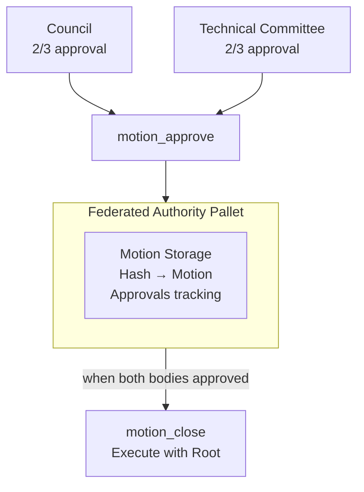

# pallet-federated-authority

Cross-collective governance mechanism requiring multi-body approval for privileged operations.

## Overview

The `federated_authority` [pallet](https://docs.polkadot.com/polkadot-protocol/glossary/#pallet) implements a [federated authority](https://docs.midnight.network/learn/glossary#federated-authority) system where multiple distinct on-chain authority bodies must collectively approve a motion before it can be executed with elevated `Root` privileges. This creates a final checkpoint requiring consensus from multiple governance groups before any critical action can be executed.

The [pallet](https://docs.polkadot.com/polkadot-protocol/glossary/#pallet) is configurable to define:
- How many authority bodies participate in the federation
- Which collectives or governance groups those bodies represent
- The approval thresholds and voting mechanisms for each body
- The number of approvals required to dispatch a motion
- The lifetime of a motion before it expires

## API Specification

### Dispatchables

- [**`motion_approve`**](https://github.com/midnightntwrk/midnight-node/blob/main/pallets/federated-authority/src/lib.rs#L133) - Signal approval of a call from an authority body
- [**`motion_revoke`**](https://github.com/midnightntwrk/midnight-node/blob/main/pallets/federated-authority/src/lib.rs#L205) - Withdraw approval before execution
- [**`motion_close`**](https://github.com/midnightntwrk/midnight-node/blob/main/pallets/federated-authority/src/lib.rs#L261) - Finalize an approved or expired motion

### Storage Items

- [**`Motions`**](https://github.com/midnightntwrk/midnight-node/blob/main/pallets/federated-authority/src/lib.rs#L86) - Pending motions awaiting approval

### Events

- [**`Event`**](https://github.com/midnightntwrk/midnight-node/blob/main/pallets/federated-authority/src/lib.rs#L112) - MotionCreated, MotionApproved, MotionRevoked, MotionExecuted, MotionExpired

### Errors

- [**`Error`**](https://github.com/midnightntwrk/midnight-node/blob/main/pallets/federated-authority/src/lib.rs#L89) - MotionNotFound, AlreadyApproved, NotApproved, MotionExpired, InsufficientApprovals

### Config Trait

- [**`MotionCall`**](https://github.com/midnightntwrk/midnight-node/blob/main/pallets/federated-authority/src/lib.rs#L65) - The call type that can be executed
- [**`MaxAuthorityBodies`**](https://github.com/midnightntwrk/midnight-node/blob/main/pallets/federated-authority/src/lib.rs#L71) - Maximum number of authority bodies
- [**`MotionDuration`**](https://github.com/midnightntwrk/midnight-node/blob/main/pallets/federated-authority/src/lib.rs#L74) - Block count before motion expires
- [**`MotionApprovalProportion`**](https://github.com/midnightntwrk/midnight-node/blob/main/pallets/federated-authority/src/lib.rs#L76) - Required approval proportion
- [**`WeightInfo`**](https://github.com/midnightntwrk/midnight-node/blob/main/pallets/federated-authority/src/lib.rs#L82) - Weight information for extrinsics

## Motion Lifecycle

### 1. Initiating a Motion

A motion is not created directly. Instead, one of the authority bodies signals its approval of a particular call:

- The body conducts its own internal decision-making process (e.g., through a collective vote)
- If its rules are satisfied, it dispatches `motion_approve` with the target call
- On the first approval, the [pallet](https://docs.polkadot.com/polkadot-protocol/glossary/#pallet) creates a motion entry in storage with an expiration period

### 2. Gathering Approvals

Once recorded, the motion is pending further approvals:

- Each other body must go through its own internal process to approve the exact same call
- If they approve, they also dispatch `motion_approve`, adding their approval to the motion

### 3. Executing or Closing

The `motion_close` [extrinsic](https://docs.polkadot.com/polkadot-protocol/glossary/#extrinsic) can be called by anyone to finalize a motion. A motion can only be closed if it has either been approved by all required bodies or has expired.

### 4. Revoking an Approval

The `motion_revoke` [extrinsic](https://docs.polkadot.com/polkadot-protocol/glossary/#extrinsic) allows an authority body to withdraw its approval before execution. If all approvals are revoked, the motion is immediately removed from storage.

## Architecture

The federated authority mechanism requires multiple independent governance bodies to approve a motion before execution. Each body (Council, Technical Committee) conducts its own internal voting process via `pallet_collective`. Upon reaching their respective thresholds, they dispatch `motion_approve` which either creates a new motion record or adds an approval to an existing one. The pallet tracks approvals per motion hash, and when the configured approval threshold is met (e.g., both bodies approved), anyone can call `motion_close` to execute the motion with Root privileges. This creates a multi-sig-like checkpoint for critical operations.



**Sources**: [[1]](https://github.com/midnightntwrk/midnight-node/blob/main/pallets/federated-authority/src/lib.rs#L133-L197) [[2]](https://github.com/midnightntwrk/midnight-node/blob/main/pallets/federated-authority/src/lib.rs#L261-L320) [[3]](https://github.com/midnightntwrk/midnight-node/blob/main/runtime/src/lib.rs#L916-L954)

## Integration

### Dependencies

- `frame-support` / `frame-system` - [FRAME](https://docs.polkadot.com/polkadot-protocol/glossary/#frame-framework-for-runtime-aggregation-of-modularized-entities) primitives
- `pallet-collective` - For authority body voting

### Used By

- `runtime` - Governance configuration
- `pallet-federated-authority-observation` - Membership updates

## Testing

```bash
cargo test -p pallet-federated-authority
```

## See Also

- [pallet-federated-authority-observation](../federated-authority-observation/README.md) - Membership sync from Cardano
- [GLOSSARY - Federated Authority](https://docs.midnight.network/learn/glossary#federated-authority) - Term definition
