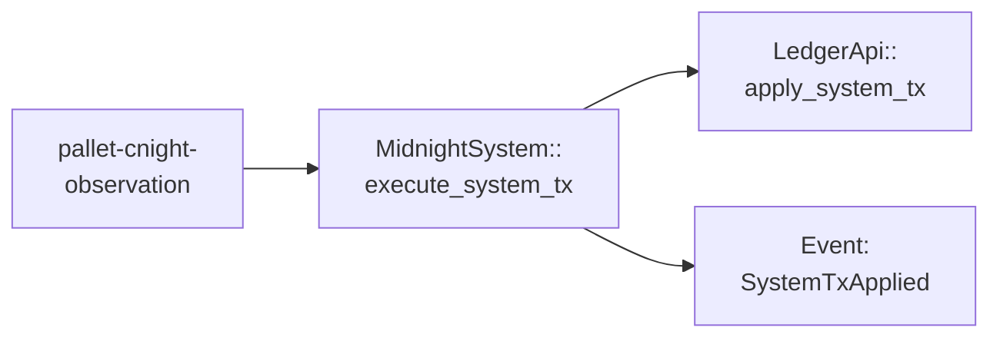

# pallet-midnight-system

[FRAME](https://docs.polkadot.com/polkadot-protocol/glossary/#frame-framework-for-runtime-aggregation-of-modularized-entities) pallet for executing Midnight System Transactions with root privileges.

## Overview

This pallet provides a privileged interface for applying system-level transactions to the Midnight ledger. System transactions are generated from Cardano observations (e.g., [cNIGHT](https://docs.midnight.network/learn/glossary#cnight) registrations, [DUST](https://docs.midnight.network/learn/glossary#dust) generation) and require root origin to execute. The pallet implements `MidnightSystemTransactionExecutor` trait used by observation pallets.

Unlike regular user transactions processed through `pallet-midnight`, system transactions bypass standard validation and fee mechanisms since they represent state changes already finalized on the Cardano mainchain. The root origin requirement ensures only trusted pallets (specifically `pallet-cnight-observation`) can invoke these privileged operations, maintaining the security boundary between user-submitted and system-generated state transitions.

## API Specification

### Dispatchables

- [**`send_mn_system_transaction`**](https://github.com/midnightntwrk/midnight-node/blob/main/pallets/midnight-system/src/lib.rs#L69) - Apply a serialized system transaction

### Events

- [**`SystemTransactionApplied`**](https://github.com/midnightntwrk/midnight-node/blob/main/pallets/midnight-system/src/lib.rs#L30) - System tx successfully applied

### Errors

- [**`LedgerApiError`**](https://github.com/midnightntwrk/midnight-node/blob/main/pallets/midnight-system/src/lib.rs#L38) - Wrapped ledger API error

### Config Trait

- [**`LedgerStateProviderMut`**](https://github.com/midnightntwrk/midnight-node/blob/main/pallets/midnight-system/src/lib.rs#L49) - Access to ledger state
- [**`LedgerBlockContextProvider`**](https://github.com/midnightntwrk/midnight-node/blob/main/pallets/midnight-system/src/lib.rs#L50) - Block context (timestamp, hash)

### Storage

- [**`ConfigurableSystemTxWeight`**](https://github.com/midnightntwrk/midnight-node/blob/main/pallets/midnight-system/src/lib.rs#L62) - Processing weight for system transactions

## Architecture

System transactions originate from Cardano observations processed by `pallet-cnight-observation`. When a registration, UTXO creation, or redemption is observed, the observation pallet constructs a Cardano Midnight System Transaction (CMST) and calls `MidnightSystemTransactionExecutor::execute_system_tx`. This pallet then applies the serialized system transaction to the ledger via root-privileged host functions, emitting a `SystemTransactionApplied` event upon success. The root origin requirement ensures only trusted observation pallets can trigger ledger state mutations.

**Sources**: [[1]](https://github.com/midnightntwrk/midnight-node/blob/main/pallets/midnight-system/src/lib.rs#L69-L99) [[2]](https://github.com/midnightntwrk/midnight-node/blob/main/pallets/midnight-system/src/lib.rs#L101-L120)

## Integration

### Dependencies

- `midnight-node-ledger` - Ledger bridge API
- `midnight-primitives` - `MidnightSystemTransactionExecutor` trait

### Used By

- `pallet-cnight-observation` - Executes [DUST](https://docs.midnight.network/learn/glossary#dust) registration system transactions

## See Also

- [pallet-midnight](../midnight/README.md) - Core ledger pallet
- [pallet-cnight-observation](../cnight-observation/README.md) - Cardano bridge

