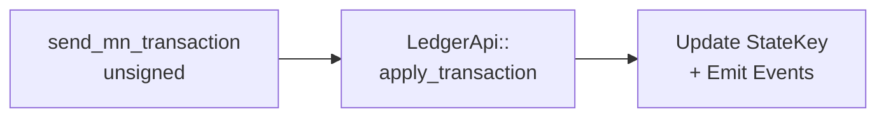
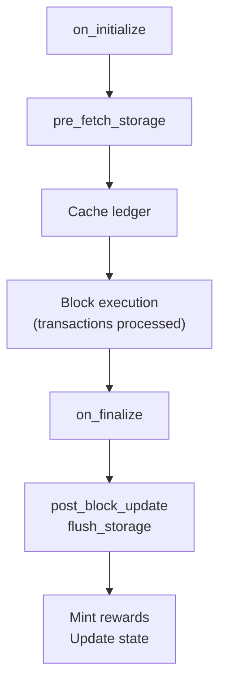

# pallet-midnight

Core [FRAME](https://docs.polkadot.com/polkadot-protocol/glossary/#frame-framework-for-runtime-aggregation-of-modularized-entities) pallet managing Midnight ledger state and transaction execution.

## Overview

This pallet is the primary interface between the Substrate runtime and the Midnight ledger. It processes privacy-preserving transactions, maintains the ledger state root, and emits events for contract operations. All Midnight transactions flow through this pallet's `send_mn_transaction` extrinsic.

The pallet implements `LedgerStateProviderMut` and `LedgerBlockContextProvider` traits, enabling other pallets to interact with ledger state.

## API Specification

### Dispatchables

- [**`send_mn_transaction`**](https://github.com/midnightntwrk/midnight-node/blob/main/pallets/midnight/src/lib.rs#L352) - Process a Midnight transaction (ZSwap, contract deploy/call)
- [**`set_tx_size_weight`**](https://github.com/midnightntwrk/midnight-node/blob/main/pallets/midnight/src/lib.rs#L414) - Configure transaction weight

### Storage Items

- [**`StateKey`**](https://github.com/midnightntwrk/midnight-node/blob/main/pallets/midnight/src/lib.rs#L139) - Current ledger state root
- [**`NetworkId`**](https://github.com/midnightntwrk/midnight-node/blob/main/pallets/midnight/src/lib.rs#L142) - Network identifier (e.g., "undeployed")
- [**`ConfigurableTransactionSizeWeight`**](https://github.com/midnightntwrk/midnight-node/blob/main/pallets/midnight/src/lib.rs#L156) - Transaction processing weight

### Events

- [**`ContractDeploy`**](https://github.com/midnightntwrk/midnight-node/blob/main/pallets/midnight/src/lib.rs#L219) - Contract deployed with address
- [**`ContractCall`**](https://github.com/midnightntwrk/midnight-node/blob/main/pallets/midnight/src/lib.rs#L217) - Contract entrypoint invoked
- [**`ContractMaintain`**](https://github.com/midnightntwrk/midnight-node/blob/main/pallets/midnight/src/lib.rs#L223) - Contract authority/verifier updated
- [**`TxApplied`**](https://github.com/midnightntwrk/midnight-node/blob/main/pallets/midnight/src/lib.rs#L221) - Transaction fully applied
- [**`TxPartialSuccess`**](https://github.com/midnightntwrk/midnight-node/blob/main/pallets/midnight/src/lib.rs#L231) - Guaranteed part applied, conditional failed
- [**`UnshieldedTokens`**](https://github.com/midnightntwrk/midnight-node/blob/main/pallets/midnight/src/lib.rs#L229) - UTXO transfers (spent/created)
- [**`PayoutMinted`**](https://github.com/midnightntwrk/midnight-node/blob/main/pallets/midnight/src/lib.rs#L225) - Block reward minted
- [**`ClaimRewards`**](https://github.com/midnightntwrk/midnight-node/blob/main/pallets/midnight/src/lib.rs#L227) - Rewards claimed by beneficiary

### Errors

- [**`Transaction`**](https://github.com/midnightntwrk/midnight-node/blob/main/pallets/midnight/src/lib.rs#L244) - Ledger transaction validation/execution error
- [**`Deserialization`**](https://github.com/midnightntwrk/midnight-node/blob/main/pallets/midnight/src/lib.rs#L240) - Failed to decode transaction
- [**`NoLedgerState`**](https://github.com/midnightntwrk/midnight-node/blob/main/pallets/midnight/src/lib.rs#L248) - Ledger state not initialized
- [**`BlockLimitExceededError`**](https://github.com/midnightntwrk/midnight-node/blob/main/pallets/midnight/src/lib.rs#L254) - Transaction exceeds block limits

### Config Trait

- [**`BlockReward`**](https://github.com/midnightntwrk/midnight-node/blob/main/pallets/midnight/src/lib.rs#L125) - Block reward amount and beneficiary
- [**`SlotDuration`**](https://github.com/midnightntwrk/midnight-node/blob/main/pallets/midnight/src/lib.rs#L128) - Slot duration for timestamp calculations

## Architecture

### Transaction Flow

All Midnight transactions enter through the `send_mn_transaction` unsigned extrinsic. The pallet deserializes the transaction, invokes the LedgerApi host function to apply it against the current state, and emits appropriate events (ContractDeploy, ContractCall, TxApplied, etc.) based on the transaction outcome. The unsigned nature allows transactions to be submitted without a Substrate account, as fees are handled within the ZSwap ledger.



**Sources**: [[1]](https://github.com/midnightntwrk/midnight-node/blob/main/pallets/midnight/src/lib.rs#L352-L408)

### Block Lifecycle

The pallet hooks into Substrate's block lifecycle at two points. During `on_initialize`, it pre-fetches ledger storage into a cache for efficient access during transaction processing. After all transactions are processed, `on_finalize` triggers post-block updates including block reward minting and flushing the storage cache to persistent storage. This two-phase approach optimizes storage I/O by batching reads at block start and writes at block end.



**Sources**: [[1]](https://github.com/midnightntwrk/midnight-node/blob/main/pallets/midnight/src/lib.rs#L285-L346)

## Usage

### Querying State (via RPC)

```bash
# Get contract state
curl -X POST -H "Content-Type: application/json" \
  --data '{"jsonrpc":"2.0","method":"midnight_contractState","params":["<hex_address>"],"id":1}' \
  http://localhost:9944

# Get ledger version
curl -X POST -H "Content-Type: application/json" \
  --data '{"jsonrpc":"2.0","method":"midnight_ledgerVersion","params":[],"id":1}' \
  http://localhost:9944
```

## Integration

### Dependencies

- `midnight-node-ledger` - Ledger bridge API
- `midnight-primitives` - Shared types and traits
- `pallet-timestamp` - Block timestamp for context

### Used By

- [`runtime`](https://github.com/midnightntwrk/midnight-node/blob/main/runtime/src/lib.rs) - Wired as primary transaction processor
- [`pallet-midnight-rpc`](https://github.com/midnightntwrk/midnight-node/blob/main/pallets/midnight/rpc/src/lib.rs) - RPC interface to ledger queries
- [`pallet-cnight-observation`](https://github.com/midnightntwrk/midnight-node/blob/main/pallets/cnight-observation/src/lib.rs) - [System transaction](https://docs.midnight.network/learn/glossary#system-transaction) execution

## Testing

```bash
cargo test -p pallet-midnight
```

## See Also

- [pallet-midnight-rpc](rpc/README.md) - RPC interface
- [pallet-midnight-system](../midnight-system/README.md) - System transactions
- [ledger](../../ledger/README.md) - Ledger bridge implementation
