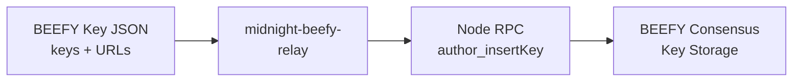

# midnight-beefy-relay

[BEEFY](https://docs.midnight.network/learn/glossary#beefy-bridge-efficiency-enabling-finality-yielder) key management and relay service for cross-chain bridge operations.

## Overview

This crate provides tooling for managing [BEEFY](https://docs.midnight.network/learn/glossary#beefy-bridge-efficiency-enabling-finality-yielder) consensus keys required for Midnight's cross-chain bridge with Cardano. [BEEFY](https://docs.midnight.network/learn/glossary#beefy-bridge-efficiency-enabling-finality-yielder) produces compact finality proofs that can be efficiently verified on external chains.

## Prerequisites

Start the Midnight node with archival settings:

```bash
midnight-node \
    --state-pruning archive \
    --blocks-pruning archive \
    --enable-offchain-indexing true
```

Ensure [BEEFY](https://docs.midnight.network/learn/glossary#beefy-bridge-efficiency-enabling-finality-yielder) keys are inserted and the first session has passed.

## API Specification

### CLI Commands

- [**`--keys-path <file>`**](https://github.com/midnightntwrk/midnight-node/blob/main/relay/src/main.rs#L36) - Insert [BEEFY](https://docs.midnight.network/learn/glossary#beefy-bridge-efficiency-enabling-finality-yielder) keys from JSON file

### Key File Format

```json
[
  {
    "suri": "//Alice",
    "pub_key": "0x020a1091341fe5664bfa1782d5e04779689068c916b04cb365ec3153755684d9a1",
    "node_url": "ws://localhost:9937"
  }
]
```

- **`suri`** - Secret URI (seed phrase or dev account)
- **`pub_key`** - ECDSA public key in hex format
- **`node_url`** - WebSocket URL of the target node

## Usage

### Inserting BEEFY Keys

#### Via this Relayer

```bash
cargo run --bin midnight-beefy-relay -- --keys-path=./beefy-keys.json
```

Output:
```
Added beefy key: 0x020a1091341fe5664bfa1782d5e04779689068c916b04cb365ec3153755684d9a1 to ws://localhost:9933
```

#### Via Polkadot.js

1. Go to Developer → RPC Calls
2. Select `author` endpoint and `insertKey` method
3. Input: keyType=`beef`, suri=`<secret>`, publicKey=`<ECDSA pubkey>`

#### Via curl

```bash
curl http://localhost:9933 -H "Content-Type:application/json;charset=utf-8" -d '{
    "jsonrpc":"2.0",
    "id":1,
    "method":"author_insertKey",
    "params":["beef","<suri>","<publicKey>"]
}'
```

### Example Key Files

See `res/mock-bridge-data/beefy-keys-mock.json` for example configuration.

## Architecture

The BEEFY relay tool automates key insertion for validators participating in bridge consensus. It reads a JSON file containing BEEFY key configurations (secret URIs, public keys, and target node URLs), then iterates through each entry calling the node's `author_insertKey` RPC method. The node stores these ECDSA keys in its keystore, making them available for BEEFY signature production. This tool is primarily used during validator setup and key rotation operations.



**Sources**: [[1]](https://github.com/midnightntwrk/midnight-node/blob/main/relay/src/main.rs#L27-L60) [[2]](https://github.com/midnightntwrk/midnight-node/blob/main/relay/src/beefy_keys.rs#L34-L54)

## Integration

### Dependencies

- Midnight node with [BEEFY](https://docs.midnight.network/learn/glossary#beefy-bridge-efficiency-enabling-finality-yielder) enabled
- ECDSA key pairs for each validator

### Used By

- Validator operators for key management
- CI/CD for test network setup

## Testing

```bash
cargo test -p relay
```

## See Also

- [GLOSSARY - BEEFY](https://docs.midnight.network/learn/glossary#beefy-bridge-efficiency-enabling-finality-yielder) - Protocol description
- [res/mock-bridge-data](../res/mock-bridge-data/) - Example key files
- [node](../node/README.md) - Node configuration
