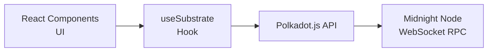

# ui

React-based frontend for interacting with the Midnight blockchain.

## Overview

A barebones UI based on the [Substrate front end template](https://github.com/jimmychu0807/substrate-front-end-template) that provides a web interface for:

- Connecting to Midnight nodes via WebSocket
- Account selection and balance display
- Transaction submission
- Chain state queries

## Installation

```bash
yarn install
```

## Usage

### Development Mode

Connect to a locally running node:

```bash
yarn start
```

### Production Build

```bash
yarn build
```

Open `build/index.html` in your browser.

## API Specification

### React Hooks

- [**`useSubstrate()`**](https://github.com/midnightntwrk/midnight-node/blob/main/ui/src/substrate-lib/SubstrateContext.jsx#L182) - Access to Polkadot.js API, keyring, and blockchain
- [**`useSubstrateState()`**](https://github.com/midnightntwrk/midnight-node/blob/main/ui/src/substrate-lib/SubstrateContext.jsx#L183) - Shorthand for read-only state access

### useSubstrate State

```javascript
{
  socket,        // Remote provider WebSocket URL
  keyring,       // Available accounts keyring
  keyringState,  // "READY" | "ERROR"
  api,           // Polkadot.js API instance
  apiState,      // "CONNECTING" | "READY" | "ERROR"
  currentAccount,// Selected account pair
  setCurrentAccount // Function to update selection
}
```

### Components

- [**`TxButton`**](https://github.com/midnightntwrk/midnight-node/blob/main/ui/src/substrate-lib/components/TxButton.jsx#L22) - Handles query and transaction requests
- [**`AccountSelector`**](https://github.com/midnightntwrk/midnight-node/blob/main/ui/src/AccountSelector.jsx#L152) - Unified account selection with balance display

## Configuration

Configuration is loaded in order (later overrides earlier):
1. `src/config/common.json`
2. Environment-specific JSON (`development.json`, `test.json`, `production.json`)
3. Environment variables

### Config Files

| File | Environment |
|------|-------------|
| `development.json` | `yarn start` |
| `test.json` | `yarn test` |
| `production.json` | `yarn build` |

### Environment Variables

| Variable | Config Key | Description |
|----------|------------|-------------|
| `VITE_PROVIDER_SOCKET` | `PROVIDER_SOCKET` | WebSocket endpoint |

### Specifying WebSocket Connection

Two methods:
1. Set `PROVIDER_SOCKET` in config JSON files
2. URL query parameter: `?rpc=ws://localhost:9944` (overrides config)

## Architecture

The UI follows a layered architecture with React components at the presentation layer. Components access blockchain state and submit transactions through the `useSubstrate` hook, which provides a React Context wrapper around the Polkadot.js API. The API maintains a WebSocket connection to a Midnight node, subscribing to state changes and handling transaction lifecycle. This architecture decouples UI components from blockchain specifics, allowing them to interact with the chain through a familiar React hooks pattern.



**Sources**: [[1]](https://github.com/midnightntwrk/midnight-node/blob/main/ui/src/substrate-lib/SubstrateContext.jsx) [[2]](https://github.com/midnightntwrk/midnight-node/blob/main/ui/src/substrate-lib/index.js)

### Directory Structure

```
ui/
+-- src/
|   +-- config/           # Environment configs
|   +-- substrate-lib/    # Polkadot.js integration
|   |   +-- components/   # TxButton, etc.
|   +-- AccountSelector.js
|   +-- Transfer.js       # Transaction example
+-- public/
+-- tests/
```

## Integration

### Dependencies

- `@polkadot/api` - Substrate RPC client
- `@polkadot/keyring` - Account management
- React + Vite - Frontend framework

### Used By

- Developers for local testing
- Demo and debugging purposes

## Browser Compatibility

Polkadot.js depends on `BigInt`. Update `package.json` for compatibility:

```json
{
  "browserslist": {
    "production": [
      ">0.2%",
      "not ie <= 99",
      "not android <= 4.4.4",
      "not dead",
      "not op_mini all"
    ]
  }
}
```

## Testing

```bash
yarn test
```

## See Also

- [node](../node/README.md) - Midnight node documentation
- [Polkadot.js Documentation](https://polkadot.js.org/docs/) - API reference
