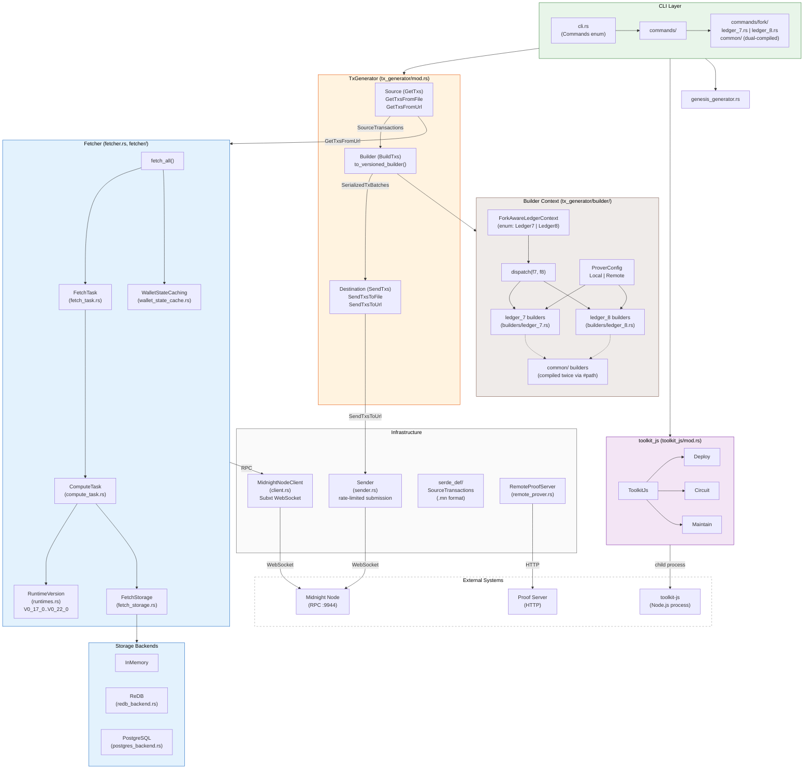
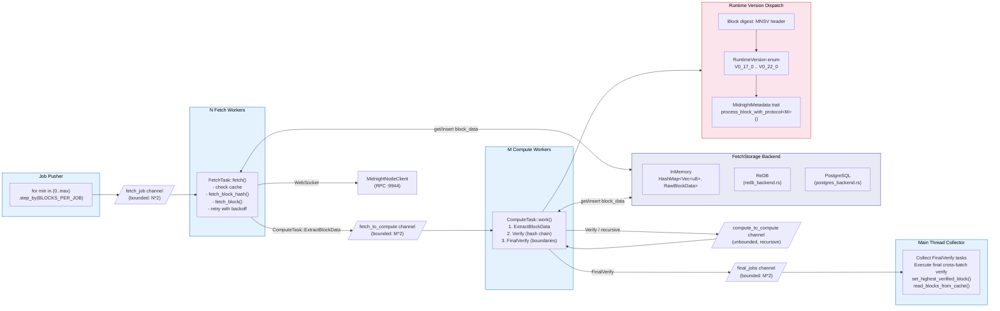
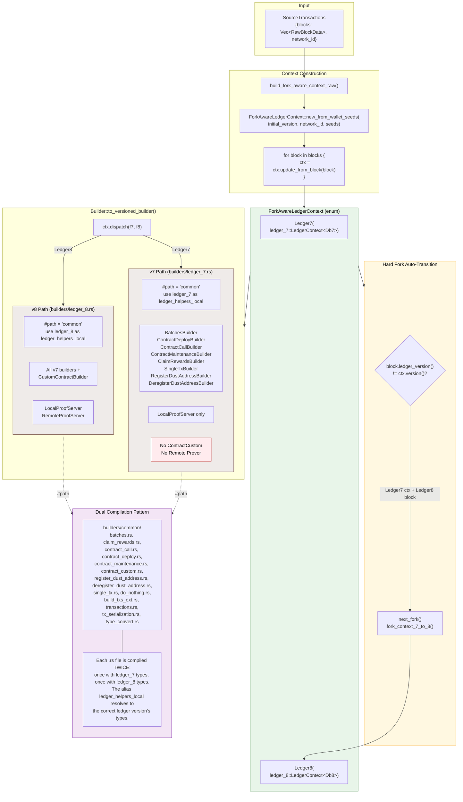

# Toolkit Architecture

## Diagram 1: Component Overview



### Legend

| Color | Component | Re-implements |
|-------|-----------|---------------|
| Blue | Fetcher, Storage Backends | Indexer -- parallel block fetching, extraction, and caching |
| Brown | Builder Context | Wallet -- ledger context management, wallet state, proof generation |
| Purple | toolkit_js | midnight-js -- custom contract Deploy/Circuit/Maintain via Node.js bridge |
| Green | CLI Layer | -- |
| Orange | TxGenerator | -- |
| Grey | Infrastructure, External | -- |

---

## Diagram 2: Fetcher Pipeline Detail



### Pipeline stages

1. **Job Pusher** -- iterates `min_height..max_height` in steps of `BLOCKS_PER_JOB` (100), pushes `FetchTask::FetchBlocks { min, max }` onto the bounded `fetch_job` channel.
2. **Fetch Workers** (N) -- each connects its own `MidnightNodeClient`. Pulls from `fetch_job`, checks storage cache, fetches missing blocks via RPC with exponential backoff, emits `ComputeTask::ExtractBlockData`.
3. **Compute Workers** (M) -- pull from both `fetch_to_compute` and `compute_to_compute` (biased toward fetch). Execute three phases:
   - `ExtractBlockData` -- calls `extract_data()` which dispatches on `RuntimeVersion` via `MidnightMetadata` trait, stores `RawBlockData` in storage. Emits `Verify`.
   - `Verify` -- checks parent-child hash chain within the batch. Emits `FinalVerify`.
   - `FinalVerify` -- checks cross-batch boundary hashes. Sent to main thread.
4. **Collector** -- main thread gathers all `FinalVerify` tasks, executes them, calls `set_highest_verified_block()`, then `read_blocks_from_cache()` to return all blocks.

---

## Diagram 3: Ledger Version Dispatch



### How dual compilation works

Both `builders/ledger_7.rs` and `builders/ledger_8.rs` use the same pattern:

```rust
#[path = "common"]
#[allow(clippy::duplicate_mod)]
pub mod inner {
    pub use midnight_node_ledger_helpers::ledger_N as ledger_helpers_local;
    // ... mod declarations for each builder
}
pub use inner::*;
```

The `common/*.rs` files reference `ledger_helpers_local` for all ledger types (e.g., `Wallet`, `LedgerContext`, `ProofProvider`). Because `ledger_helpers_local` is aliased to the version-specific module before the `mod` declarations, each file compiles against the correct ledger version's types.

The same pattern is used in `commands/fork/ledger_7.rs` and `commands/fork/ledger_8.rs` for read-only commands (show-wallet, dust-balance, etc.).

### v7 limitations

- **No `ContractCustom`** -- `EncodedOutputInfo` does not implement ledger_7 `BuildOutput`
- **No Remote Prover** -- returns `BuilderConstructionError::RemoteProverNotSupportedForLedger7`
- **Auto-transition** -- `update_from_block()` detects when a Ledger7 context receives a Ledger8 block and calls `next_fork()` -> `fork_context_7_to_8()` to migrate state
