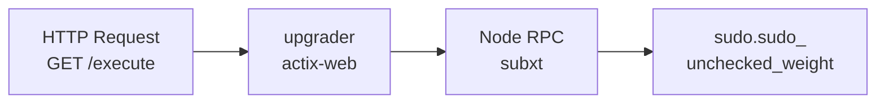

# upgrader

HTTP service for triggering runtime upgrades on Midnight nodes.

## Overview

This utility provides a simple HTTP interface to apply runtime upgrades. It's designed for:

- **Automated deployments** - Trigger upgrades via HTTP request
- **Testing hardforks** - Test upgrade scenarios in controlled environments
- **Coordinated upgrades** - Wait for external signal before applying

## Usage

### Running the Service

```bash
upgrader \
  --runtime-path ./runtime.wasm \
  --signer-key "//Alice" \
  --rpc-url ws://localhost:9944 \
  --port 8080
```

### CLI Options

| Option | Env Var | Default | Description |
|--------|---------|---------|-------------|
| `--runtime-path` | `RUNTIME_PATH` | (required) | Path to WASM runtime |
| `--signer-key` | `SIGNER_KEY` | `//Alice` | Sudo/authority key seed |
| `--rpc-url` | `RPC_URL` | `ws://localhost:9944` | Node WebSocket URL |
| `--port` | `PORT` | `8080` | HTTP server port |
| `--timeout` | `TIMEOUT` | (none) | Auto-execute after N seconds |

### HTTP Endpoints

| Endpoint | Method | Description |
|----------|--------|-------------|
| `/` | GET | Health check (returns "ok") |
| `/execute` | GET | Trigger the runtime upgrade |

### Response Codes

| Code | Description |
|------|-------------|
| 200 | Upgrade executed successfully |
| 409 | Upgrade already executed |
| 500 | Error during upgrade |

## Architecture



**Sources**: [[1]](https://github.com/midnightntwrk/midnight-node/blob/main/util/upgrader/src/main.rs#L58-L66) [[2]](https://github.com/midnightntwrk/midnight-node/blob/main/util/upgrader/src/lib.rs#L40)

## Example Workflow

1. Start a Midnight node:
   ```bash
   midnight-node --dev
   ```

2. Start the upgrader:
   ```bash
   upgrader --runtime-path new_runtime.wasm
   ```

3. Trigger the upgrade:
   ```bash
   curl http://localhost:8080/execute
   ```

## Integration

### Dependencies

- `actix-web` - HTTP server
- `subxt` / `subxt-signer` - Substrate RPC client
- `clap` - CLI argument parsing

### Used By

- CI/CD pipelines for automated testing
- `hardfork-test-upgrader` Docker image

## See Also

- [runtime](../../runtime/README.md) - [Runtime](https://docs.midnight.network/learn/glossary#runtime) being upgraded
- [images/hardfork-test-upgrader](../../images/hardfork-test-upgrader/Dockerfile) - Docker image

